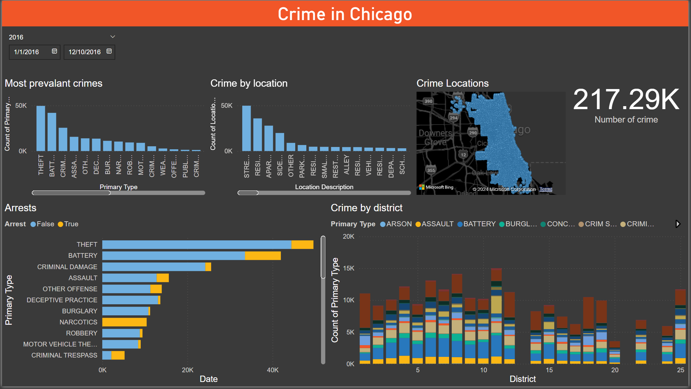

# 🚔 Crime Analysis in Chicago (2014-2016)

[](https://opensource.org/licenses/MIT)
[](https://powerbi.microsoft.com/)
[](Datasets/chicago%20crime%20data.xlsx)
[]()
[]()
[](https://github.com/pouryare)

A comprehensive Power BI dashboard analyzing crime patterns in Chicago from 2014 to 2016. This interactive visualization tool provides insights into crime types, locations, arrest rates, and district-wise distribution of criminal activities.



## 📋 Table of Contents
- [Overview](#overview)
- [Key Features](#key-features)
- [Dashboard Components](#dashboard-components)
- [Dataset Description](#dataset-description)
- [Technical Implementation](#technical-implementation)
- [Installation](#installation)
- [File Structure](#file-structure)
- [Key Insights](#key-insights)
- [License](#license)

## 🎯 Overview

The Chicago Crime Analysis Dashboard transforms complex crime data into actionable insights through detailed visualization of crime patterns, geographic distribution, arrest rates, and district-wise analysis. It enables data-driven decision-making for law enforcement resource allocation and crime prevention strategies.

## ✨ Key Features

- 📍 Geographic Crime Mapping
- 📊 Crime Type Distribution
- 🏢 District-wise Analysis
- 🚓 Arrest Rate Tracking
- 📅 Temporal Analysis
- 📍 Location-based Patterns
- 🗺️ Interactive Maps

## 📊 Dashboard Components

### 1. Crime Maps
- Interactive geographic visualization
- District-wise crime hotspots
- Year-by-year comparison (2014-2016)

### 2. Most Prevalent Crimes
- Top crime types by frequency
- Year-over-year comparison
- Trend analysis

### 3. Crime by Location
- Street-level analysis
- Residential vs. Commercial areas
- High-risk location identification

### 4. Arrest Statistics
- Arrest rates by crime type
- District-wise arrest performance
- True/False arrest indicators

### 5. District Analysis
- Crime distribution across districts
- Crime type concentration
- District-wise comparison

## 📚 Dataset Description

The dataset includes comprehensive crime records from 2014 to 2016 with the following key variables:

- Date and Time of Crime
- Location Information
- Primary Type of Crime
- District Number
- Arrest Status
- Geographic Coordinates

## 🔧 Technical Implementation

### Data Cleaning Steps
1. Date/Time separation
2. Coordinate system validation
3. District mapping
4. Null value handling
5. Category standardization

### Visualization Types
1. Interactive Maps
2. Bar Charts
3. Stacked Column Charts
4. Time Series Plots
5. Statistical Cards

## 📥 Installation

```bash
# Clone this repository
git clone https://github.com/pouryare/Chicago-Crime-Analysis.git
cd Chicago-Crime-Analysis

# Open the .pbix file
# Connect to your data source
# Refresh the dashboard
```

## 📁 File Structure

```
📦 Chicago-Crime-Analysis
 ┣ 📂 Datasets
 ┃ ┗ 📄 chicago crime data.xlsx
 ┣ 📜 .gitattributes
 ┣ 📜 Chicago Crime.pbix
 ┣ 📜 LICENSE
 ┣ 📜 README.md
 ┣ 📷 screenshot-2014.png
 ┣ 📷 screenshot-2015.png
 ┗ 📷 screenshot-2016.png
```

## 🔍 Key Insights

1. **Crime Rate Trends**
   - Overall decrease in crime rate from 2014 (274.41K) to 2016 (217.29K)
   - Consistent patterns in crime type distribution

2. **Most Common Crimes**
   - Theft leads across all years
   - Battery and criminal damage follow as most frequent

3. **Location Patterns**
   - Street-level crimes most common
   - Residential areas show significant concentration
   - Clear hotspots in specific districts

4. **Arrest Statistics**
   - Varying arrest rates by crime type
   - District-specific enforcement patterns
   - Higher arrest rates for certain crime categories

## 📄 License

This project is licensed under the MIT License - see the [LICENSE](LICENSE) file for details.

Made with ❤️ by [Pourya](https://github.com/pouryare)

[](https://github.com/pouryare)